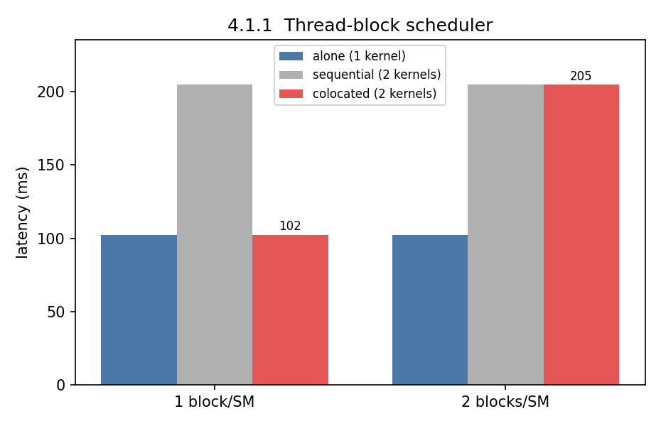
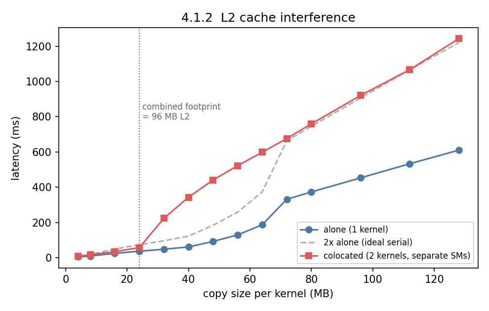
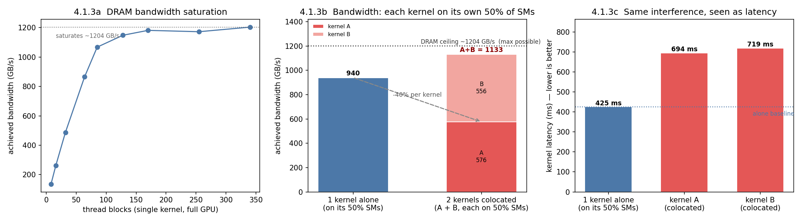

# Section 4.1 — Inter-SM Interference on the GPU

**Reproduction of "Understanding GPU Resource Interference One Level Deeper" (SoCC'25), §4.1**
Hardware: **NVIDIA GeForce RTX 5090** (Blackwell, `sm_120`, 170 SMs, 1536 threads/SM, ~96 MB L2, 32 GB GDDR7), CUDA 12.8, driver 580.126.09. Single GPU (`CUDA_VISIBLE_DEVICES=0`).

---

## 1. Introduction

When two GPU kernels run at the same time ("colocation"), they share hardware. The paper's thesis is that whether they *interfere* depends on **which specific resource** they contend for — and that coarse, whole-GPU metrics (`nvidia-smi` utilization, occupancy) cannot see it.

Section 4.1 isolates the resources that are shared **across** Streaming Multiprocessors (SMs) — i.e. contention that happens even when the two kernels run on **completely disjoint sets of SMs**:

| Experiment | Shared resource | Paper § |
|---|---|---|
| 4.1.1 Thread-block scheduler | per-SM thread/block slots + the block dispatcher | 4.1.1 |
| 4.1.2 L2 cache | the GPU-wide L2 (shared by all SMs) | 4.1.2 |
| 4.1.3 Memory bandwidth | the DRAM controllers / HBM–GDDR bus | 4.1.3 |

**Common method.** Every benchmark measures wall-clock latency (median of 10 runs) in three modes and compares them:

- **alone** — one kernel in isolation (baseline),
- **sequential** — the two kernels back-to-back (= sum of two runs),
- **colocated** — the two kernels concurrently (CUDA streams, or separate processes under MPS).

> **The tell:** if *colocated ≈ alone*, the two kernels truly ran in parallel — **no interference**. If *colocated ≈ sequential*, the hardware **serialized** them — **interference** on the shared resource under test.

To make sure any interference is genuinely *inter-SM*, the cache and bandwidth experiments place each kernel on **half of the SMs** (85 each), so the two kernels never share an SM. Anything that slows them down must be a resource *above* the SM level.

### 1.1 Hardware summary and why these SM/thread counts

Every parameter below is derived from the RTX 5090's hardware limits (queried with `cudaGetDeviceProperties`), not picked arbitrarily. The experiments are built around two ideas: **one thread block per SM** (to control concurrency at the SM level) and **half the SMs per kernel** (to force a clean inter-SM split).

Two parameters recur throughout: **`num_tb`** is the number of thread blocks a kernel launches (its *grid size*), and **`threads`** is the number of threads per block. Since a block runs entirely on one SM, launching `num_tb = 170` blocks (= the SM count) places exactly one block on each SM — this is how the experiments dial in "one block per SM," "two blocks per SM," or "half the SMs."

| RTX 5090 spec | Value | Used to set |
|---|---|---|
| Streaming Multiprocessors (SMs) | **170** | `num_tb = 170` → exactly **1 block/SM**; `2×170 = 340` → 2 blocks/SM |
| Max threads per SM | **1536** | `threads/block = 768 = 1536/2` → one block fills **half** an SM's thread budget |
| Warp schedulers (SMSPs) per SM | 4 | context for intra-SM work (§4.2), not varied here |
| Unified L1 + shared memory / SM | 128 KB | — (relevant to §4.2 L1, not §4.1) |
| **L2 cache (GPU-wide)** | **~96 MB** | sets the L2 sweep range and the ~24–32 MB/kernel interference cliff (4.1.2) |
| DRAM | 32 GB GDDR7 | 4 GB copy array (≫ L2 → true DRAM test) in 4.1.3 |
| Theoretical DRAM bandwidth | ~1792 GB/s | reference for the ~1200 GB/s *achieved* ceiling (4.1.3) |

**Why one block per SM (`num_tb = 170`, `threads = 768`).** With 768 threads, a single block occupies exactly **half** of an SM's 1536-thread budget. So *two* blocks — one from each kernel — fit on every SM simultaneously. That is the 4.1.1 "1 block/SM" case, engineered so the two kernels *can* run concurrently if the scheduler allows it. Launching **340** blocks (2 per SM) makes each kernel alone consume the SM's full thread budget, so the two kernels can no longer co-reside — isolating exactly the scheduling limit we want to observe.

**Why half the SMs per kernel (`num_tb = 85`, or MPS 50%).** The L2 (4.1.2) and bandwidth (4.1.3) experiments must attribute any slowdown to a resource *above* the SM. Giving each kernel its own **85 SMs** (= 170 / 2) guarantees the two kernels never share an SM, an L1, or a warp scheduler. If they still interfere, it can only be the GPU-wide L2 or the DRAM controllers. For 4.1.3 the same split is enforced across processes with `CUDA_MPS_ACTIVE_THREAD_PERCENTAGE=50` (MPS reports "84 visible SMs" — a rounding of 50 % × 170).

**Portability.** On a different GPU, substitute its own `multiProcessorCount`, `maxThreadsPerMultiProcessor`, and L2 size: `num_tb ← #SMs`, `threads ← maxThreadsPerSM / 2`, and re-center the L2 byte sweep on its L2 capacity. All of these live in `scripts/common.sh` and the run scripts.

---

## 2. The workloads — what the kernels actually do

The experiments do **not** use real applications. They use two tiny, deliberately one-dimensional micro-kernels, each designed to stress exactly **one** hardware resource and nothing else. That is the whole point: if a kernel only touches the scheduler, then any interference it suffers *must* be scheduler interference — there is no other resource it could be fighting over.

| Kernel | Source | What it does | Resource it stresses | What it deliberately avoids |
|---|---|---|---|---|
| `sleep_kernel` | `kernels.cu` | Each thread loops `num_itr` times doing `nanosleep` (~1 µs per iteration) — it just waits | **Occupancy / scheduling only**: it holds thread + warp slots on an SM | No memory traffic, no arithmetic, no cache use |
| `copy_kernel` | `kernels.cu` | Grid-strided memory copy `out[i] = in[i]` over `num_floats` elements, repeated `num_itr` times, fully coalesced | **Memory system**: L1 → L2 → DRAM | Almost no arithmetic (one load + one store per element) |

### 2.1 `sleep_kernel` — a pure "occupy a slot and wait" probe

```cuda
__global__ void sleep_kernel(long long num_itr) {
    for (long long i = 0; i < num_itr; ++i)
        asm volatile("nanosleep.u32 1000;");   // suspend this warp ~1000 ns
}
```

A thread running this does **no useful work** — it repeatedly sleeps ~1 µs. With `num_itr = 100000` that is ~100 ms of wall-clock time (matching the measured 102 ms). Crucially it reads no memory, issues no FP/INT math, and uses no cache. So while it runs, the only GPU resource it is consuming is a **residency slot on an SM** (thread slots, warp slots, one block slot). That makes it the perfect instrument for 4.1.1: latency changes can *only* come from whether the thread-block scheduler can place both kernels' blocks at once — never from memory or compute contention.

### 2.2 `copy_kernel` — a pure memory-streaming probe

```cuda
__global__ void copy_kernel(float *in, float *out, long long num_floats, long long num_itr) {
    size_t start = threadIdx.x + blockDim.x * blockIdx.x;
    size_t step  = gridDim.x  * blockDim.x;          // grid stride
    for (size_t j = 0; j < num_itr; j++)             // repeat the whole copy num_itr times
        for (size_t i = start; i < num_floats; i += step)
            out[i] = in[i];                          // coalesced load + store
}
```

Every thread streams a slice of the array from `in` to `out`; together the grid copies the whole `num_floats`-element buffer once per outer iteration, and the outer loop repeats that `num_itr` times. Two design details matter:

- **The repetition (`num_itr`) is what creates cache behavior.** Copying the *same* buffer over and over means that if the buffer fits in a cache, the second and later passes hit that cache instead of DRAM. This is exactly the lever 4.1.2 pulls: sweep the buffer size and watch the moment it stops fitting in L2.
- **The size of the buffer decides the regime.** A small buffer lives in L2 (tests the **L2**, 4.1.2); a buffer far larger than L2 (4 GB) can never be cached and must stream from DRAM every time (tests **DRAM bandwidth**, 4.1.3). Same kernel, two different resources, selected purely by the `num_bytes` argument.

### 2.3 How a "two-kernel" scenario is built

In every 4.1 experiment the two colocated kernels are **two independent instances of the *same* kernel** (two sleeps, or two copies) — each with its own launch and, for the copy kernel, its **own separate input/output buffers** (`init_copy_memory` is called twice). Using identical workloads is intentional: it removes "these two kernels are just different" as an explanation, so any slowdown is attributable purely to the shared *hardware resource*, not to a workload mismatch. Each run is reported as the **median of 10 repetitions**, timed with CUDA events. The three modes differ only in *how* the two instances are launched:

- **alone** — one instance on the default stream.
- **sequential** — instance 1, then instance 2, back-to-back on the default stream (so the total is essentially two isolated runs summed).
- **colocated** — instance 1 on `stream1`, instance 2 on `stream2`, both non-blocking so the GPU may overlap them; the reported time is the **makespan** (from the first kernel's start to the last kernel's finish).

With that vocabulary fixed, the three experiments below simply change *which resource* the identical kernels are forced to share.

---

## 3. Experiment 4.1.1 — Thread-Block Scheduler

**What this shows.** Whether two kernels run at the same time or get run one-after-another is *not* something the programmer controls — it is decided by the GPU's thread-block scheduler, based purely on whether both kernels' blocks physically fit on the SMs at once. This experiment demonstrates that a single change — how many thread slots each kernel reserves per SM — flips two *identical* kernels from perfect concurrency to full serialization, with no change to the work they do.

**Setup.** Two instances of `sleep_kernel` (§2.1) — the scheduler-only probe, so the *only* thing under test is block placement. Each kernel launches `num_tb` blocks of 768 threads (= half the 1536-thread SM budget). Two configurations:

- **1 block/SM:** 170 blocks — each kernel needs one block-slot's worth of the SM.
- **2 blocks/SM:** 340 blocks — each kernel alone already fills the SM's thread budget.

**Hardware placement.** The two kernels are identical `sleep_kernel` instances, and here they **do share every SM** — that is the whole design. Both spread their blocks across all 170 SMs, so each SM hosts blocks from *both* kernels competing for the same thread/warp slots. The two runs differ only in how many blocks each kernel launches (shown below as *Run A* / *Run B*).

| | Kernel A | Kernel B |
|---|---|---|
| Launched from | stream 1 (same process) | stream 2 (same process) |
| Blocks per kernel (`num_tb`) | 170 (Run A) / 340 (Run B) | 170 (Run A) / 340 (Run B) |
| Threads per block | 768 | 768 |
| SMs each kernel uses (at most) | all 170 | all 170 |
| Blocks per SM (per kernel) | 1 (Run A) / 2 (Run B) | 1 (Run A) / 2 (Run B) |
| Threads per SM (per kernel) | 768 (Run A) / 1536 (Run B) | 768 (Run A) / 1536 (Run B) |
| **Do the two kernels share an SM?** | **Yes** — both kernels' blocks land on the same 170 SMs | |
| **Do both kernels fit on an SM together?** | **Run A: yes** (1+1 blocks = 1536 threads = the SM limit). **Run B: no** (each kernel alone needs all 1536 threads, so only one fits at a time) | |
| Shared resource under test | per-SM thread / warp / block slots (the block scheduler) | |
| Deliberately *not* involved | memory, cache, compute pipelines (the sleep kernel uses none) | |



**Results.**

| Config | alone | sequential | colocated | colocated / alone |
|---|---|---|---|---|
| 1 block/SM  | 102.4 ms | 204.8 ms | **102.4 ms** | **1.00×** |
| 2 blocks/SM | 102.4 ms | 204.8 ms | **204.8 ms** | **2.00×** |

**Reading.** At **1 block/SM** the colocated run is identical to a single kernel and *2× faster than sequential* — the two kernels' blocks sit side-by-side on every SM and run fully concurrently. Double the blocks to **2/SM** and the picture flips completely: colocated now equals sequential. Each kernel alone already claims the SM's entire thread budget (2×768 = 1536), so the block scheduler cannot place both kernels' blocks at once — it **serializes** them, dispatching the second kernel's blocks only as the first kernel's blocks retire.

**Takeaway.** Identical kernels, identical per-kernel work — the *only* change is how many thread slots each kernel reserves per SM. Concurrency is not a property of the kernel; it is a property of whether the requested resources co-fit on an SM.

---

## 4. Experiment 4.1.2 — L2 Cache

**What this shows.** Two kernels placed on *completely separate* SMs — sharing no thread slots, no L1, no warp scheduler — should be immune to each other. This experiment shows they are not: because the L2 cache is a single structure shared by all SMs, two kernels can quietly evict each other's data and slow each other down severely. It also shows the interference is not gradual but appears as a sharp cliff, exactly when their combined working set stops fitting in L2.

**Setup.** Two instances of `copy_kernel` (§2.2), each repeating its copy for 3000 iterations so a cache-resident buffer is reused across passes. Each kernel runs on **85 SMs** (half the GPU) so the two colocated kernels never share an SM — any interference is the GPU-wide L2 (~96 MB). We sweep the per-kernel copy size from 4 MB to 128 MB and compare **alone** vs **colocated**.

Because a copy kernel touches **both** an input and an output buffer, each kernel's working set is ≈ **2× its copy size**. With two colocated kernels the combined footprint is ≈ **4× the copy size**, so the L2 is expected to overflow near copy size ≈ 96 MB ÷ 4 ≈ **24 MB**.

**Hardware placement.** Each kernel launches only **85 blocks** (half the SM count). Colocated, the two kernels put 85 + 85 = 170 blocks onto 170 SMs, so the scheduler settles into **one block per SM** and no SM ends up hosting blocks from *both* kernels. They therefore share *nothing* at the SM level — no thread slots, no L1, no warp scheduler — leaving only the GPU-wide L2 (and DRAM behind it) to contend over.

| | Kernel A | Kernel B |
|---|---|---|
| Blocks per kernel (`num_tb`) | 85 | 85 |
| Threads per block | 1024 | 1024 |
| SMs each kernel occupies | its own ~85 SMs | the other ~85 SMs |
| Blocks per SM (per kernel) | 1 | 1 |
| **Do the two kernels share an SM?** | **No** — 170 blocks over 170 SMs ⇒ one block per SM, so the two kernels land on disjoint SMs | |
| Shared resource under test | the single GPU-wide **L2 cache** (~96 MB), shared by all 170 SMs | |
| Also shared (secondary) | DRAM, once the working set spills out of L2 | |
| Deliberately *not* shared | thread/warp slots, L1, warp scheduler (different SMs) | |

**How the kernels are launched.** Each kernel gets its **own buffers**; colocated they also get their **own non-blocking stream**, both launched `85 × 1024`, so they run concurrently on disjoint SMs — the only thing they share is the L2:

```text
# baseline: ONE kernel alone
record(start)
copy<<<85, 1024>>>(inA, outA, n, itr)
record(stop); synchronize(stop)
t_alone = elapsed(start, stop)
# colocated: the two kernels at once, on separate streams
record(start)
copy<<<85, 1024, streamA>>>(inA, outA, n, itr)   # kernel A  ┐ overlap on
copy<<<85, 1024, streamB>>>(inB, outB, n, itr)   # kernel B  ┘ separate streams
record(stop); synchronize(stop)
t_coloc = elapsed(start, stop)                   # makespan of the pair
```

Swept over `num_bytes` and compared — so any `t_coloc > t_alone` can only come from the shared L2.



**Results (selected).**

| Copy size | alone | colocated | colocated / alone |
|---|---|---|---|
| 8 MB   |   9.3 ms |   16.8 ms | 1.80× |
| 24 MB  |  36.8 ms |   57.0 ms | 1.55× |
| **32 MB**  |  47.9 ms |  **223.4 ms** | **4.66×** |
| 40 MB  |  61.0 ms |  342.8 ms | **5.62×** |
| 48 MB  |  92.0 ms |  440.5 ms | 4.79× |
| 64 MB  | 186.6 ms |  598.3 ms | 3.21× |
| 128 MB | 610.2 ms | 1243.2 ms | 2.04× |

**Reading.** Three regimes, visible as the gap between the red (colocated) and dashed grey (2× alone = perfect serialization) curves:

1. **Small (< 24 MB):** both kernels' data comfortably fits in L2. Colocated is ~1.4–1.8× alone — mild **L2-bandwidth** contention (both stream through the same L2), but nowhere near serialized.
2. **Knee (24 → 32 MB):** the combined footprint crosses the 96 MB L2. Colocated latency **explodes to 4–5× alone** — *worse than serial*. The two kernels evict each other's cache lines, so data that hit in L2 when alone now misses to DRAM, and both kernels pay the penalty. This is the paper's key "one level deeper" moment: whole-GPU utilization looks the same, but a shared cache silently collapses.
3. **Large (> 72 MB):** each kernel alone is already too big for L2 and is DRAM-bound on its own. Colocation can no longer make cache locality any worse, so the ratio settles back to ≈ **2.0×** — pure DRAM-bandwidth serialization (the subject of 4.1.3).

**Takeaway.** L2 interference is not gradual — it has a sharp capacity cliff. Two kernels that are individually cache-friendly can become >4× slower purely because their *combined* footprint no longer fits, even though they run on separate SMs.

---

## 5. Experiment 4.1.3 — Memory Bandwidth

**What this shows.** DRAM bandwidth is one global budget for the whole GPU, not something each SM owns a private share of. This experiment shows that two memory-bound kernels running on disjoint halves of the SMs still steal bandwidth from each other: once the memory system is saturated, splitting the SMs does not split the problem — each kernel is throttled because their *combined* demand exceeds what DRAM can deliver.

**Setup.** The same `copy_kernel` (§2.2), but with a 4 GB array — far larger than the 96 MB L2, so it can never be cached and every pass streams from DRAM (a pure bandwidth test). Two parts:

- **Part A — saturation:** one kernel on the full GPU, sweeping the number of thread blocks, measuring achieved DRAM bandwidth. Shows how much parallelism is needed to saturate memory.
- **Part B — interference:** using **MPS**, each kernel is confined to 50% of the SMs. We compare one kernel alone on its half vs two kernels each on their own half, concurrently.

**Hardware placement (Part B).** Like 4.1.2, the two kernels run on **disjoint halves of the SMs** — but here the split is *enforced* with MPS (`CUDA_MPS_ACTIVE_THREAD_PERCENTAGE=50`) rather than relying on block count, because these kernels are launched from separate processes. So again they share no SM; the difference from 4.1.2 is the *resource* they collide over: the 4 GB array can never sit in L2, so the contention is purely **DRAM bandwidth**.

| | Kernel A | Kernel B |
|---|---|---|
| Launched from | process 1 | process 2 |
| SM budget (via MPS) | 50% of SMs (~85) | the other 50% (~85) |
| Blocks per kernel (`num_tb`) | 170 → 2 blocks per SM | 170 → 2 blocks per SM |
| Threads per block | 768 | 768 |
| **Do the two kernels share an SM?** | **No** — MPS gives each process its own ~85 SMs | |
| Shared resource under test | **DRAM bandwidth** — the memory controllers / GDDR7 bus feeding all SMs | |
| Deliberately *not* shared | SMs, thread slots, L1, warp scheduler; and L2 capacity is irrelevant (4 GB ≫ 96 MB, nothing caches) | |



**How to read the figure.** This figure has **two separate plots**, and note their y-axis is **achieved DRAM bandwidth in GB/s** (higher = faster), *not* latency like the earlier experiments.

- **Left (4.1.3a — saturation curve):** a line plot for Part A. The **x-axis is the number of thread blocks** launched by a *single* kernel on the full GPU; each point is the bandwidth that one kernel achieves at that block count. Reading left→right shows bandwidth climbing as more blocks are added, then flattening once the memory system is full — the dotted line marks that ~1200 GB/s ceiling. It answers "how much parallelism does one kernel need to saturate DRAM?"
- **Right (4.1.3b — colocation, MPS):** **two bars plus two reference lines** for Part B, with bandwidth (GB/s) on the y-axis:
  - **Bar 1, "1 kernel alone (on its 50% SMs)" = 940:** the baseline — a single kernel confined to half the GPU, with nothing else running. This is what each kernel *could* get if it never had to share.
  - **Bar 2, "2 kernels colocated" = stacked A (576) + B (556) = 1133:** the two kernels run at the same time, each still pinned to its own separate half of the SMs. The bar is **stacked** so its total height is the *combined* bandwidth the GPU delivers to both kernels; the split shows each kernel's share.
  - **Dashed line at 1880 ("if independent: 2 × 940 = demanded"):** what the two kernels *together* would consume if their separate halves truly didn't interfere (just twice the baseline). It sits far *above* the ceiling — i.e. it is impossible.
  - **Dotted line at ~1204 ("DRAM ceiling = max possible"):** the most bandwidth the memory system can ever deliver, carried over from the left plot.

  Read it as a cause-and-effect chain: the two kernels *demand* 1880 GB/s (dashed line), but DRAM caps out at ~1204 (dotted line), so their combined bar is forced down to that ceiling (A + B = 1133) — which means **each kernel is throttled from its 940 baseline to ~566, a 40% loss** (the arrow into kernel A's segment). The gap between the dashed demand line and the actual stacked bar *is* the bandwidth interference, and the two reference lines explain why it is unavoidable: demand exceeds supply.

**Results — Part A (saturation).**

| Thread blocks | 8 | 32 | 64 | 85 | 128 | 170 | 340 |
|---|---|---|---|---|---|---|---|
| Bandwidth (GB/s) | 136 | 487 | 865 | 1067 | 1148 | 1182 | 1204 |

DRAM bandwidth rises steeply, then **saturates at ≈ 1200 GB/s** (~67% of the RTX 5090's ~1792 GB/s theoretical GDDR7 peak) once ≥ ~170 blocks are resident. Beyond saturation, adding blocks does nothing.

**Results — Part B (50%-SM interference).** We record *both* metrics for every run — the copy kernel reports its latency, and bandwidth is computed from it (`bandwidth = bytes moved / latency`), so the two are just inverse views of the same measurement.

| Case | Latency | Bandwidth |
|---|---|---|
| one kernel alone on 50% SMs | **425 ms** | **940 GB/s** |
| colocated, instance 1 | 694 ms | 576 GB/s |
| colocated, instance 2 | 719 ms | 556 GB/s |
| combined | 719 ms (makespan) | **1133 GB/s** (aggregate) ≈ full-GPU peak |

**Reading (bandwidth).** A single kernel on just half the SMs already reaches 940 GB/s — most of the way to the full-GPU peak. If bandwidth were free, running a second kernel on the *other* half would let each keep its 940 GB/s (aggregate 1880). Instead, the aggregate is **capped at ~1133 GB/s** — the same ceiling a single full-GPU kernel hits — so **each kernel is throttled to ~566 GB/s, a 40% loss**, purely from sharing DRAM. The two kernels touch different SMs and different memory, yet they collide at the memory controllers.

**Reading (latency).** The same interference, expressed as the metric the *user* actually feels — how long the kernel takes (panel **c** of the figure above):

A copy that finishes in **425 ms** when it has its half of the GPU to itself takes **694–719 ms** when a second kernel runs on the other half — each kernel is **~65% slower** (dotted line = the alone baseline; lower is better). Note the two latencies do **not** add up the way the bandwidths do: the kernels run *concurrently*, so the pair finishes in ~719 ms (the makespan, ≈ the slower one), not 694 + 719. This is the mirror image of the bandwidth plot — bandwidth per kernel drops ~40%, so latency per kernel rises ~65% (a 40% throughput cut means each kernel needs 1/0.6 ≈ 1.65× the time).

**Takeaway.** DRAM bandwidth is a single global budget. Two "well-separated" kernels that are each memory-hungry cannot both have it; colocation splits the fixed bandwidth roughly in half, which shows up as each kernel taking ~1.65× as long to finish.

---

## 6. Discussion

**One consistent story, three resources.** In all three experiments the kernels run on separate SMs, so a whole-GPU view ("are the SMs busy?") would predict clean parallelism. Yet interference appears whenever the two kernels contend for something *shared above the SM*:

| Resource | When it bites | Symptom | Worst slowdown seen |
|---|---|---|---|
| Block scheduler (4.1.1) | each kernel already fills the SM's thread slots | colocated = sequential | 2.0× (serialized) |
| L2 cache (4.1.2) | combined footprint > 96 MB L2 | colocated ≫ sequential | **5.6×** (mutual eviction) |
| DRAM bandwidth (4.1.3) | both kernels memory-bound | fixed bandwidth split | ~1.7× per kernel (40% loss) |

**Why coarse metrics miss this.** Every one of these cases can present as "100% SM utilization." The scheduler case even runs the *same number of instructions*; the L2 case shows the danger most sharply — a >5× regression triggered by crossing a cache-size boundary that no utilization counter reports. This is exactly the paper's argument for measuring **one level deeper**: interference is a property of *specific* shared resources (slots, L2, DRAM), not of aggregate busyness.

**Note the L2 super-linearity.** 4.1.2 is the one place colocation is *worse than serializing* the kernels (ratio > 2×). Running the kernels one-at-a-time would have preserved each one's cache locality; forcing them to share destroys it. A scheduler that naively colocates two cache-fitting kernels can therefore do real harm — the opposite of the usual "colocation improves utilization" intuition.

**RTX 5090 vs H100 (paper).** The *mechanisms* reproduce exactly; the *thresholds* differ with the hardware. The paper's H100 has a 50 MB L2 and ~3.3 TB/s HBM3; our RTX 5090 has ~96 MB L2 and ~1.2 TB/s achieved GDDR7. So our L2 cliff sits at a larger copy size and our bandwidth ceiling is lower, but the shapes — a scheduling flip at the occupancy boundary, a cache cliff at the capacity boundary, and a hard bandwidth ceiling — are identical. Any figure used from this reproduction should state the GPU explicitly.

**Limitations / knobs.** Numbers are medians of 10 runs on an otherwise-idle GPU. The L2 knee location depends on the copy kernel touching 2 buffers (footprint = 2× copy size); a different access pattern shifts it. The MPS split reports "84 visible SMs" (rounding of 50% × 170); using exactly half avoids incomplete thread-block waves that would otherwise distort bandwidth (see paper footnote). Profiling (NCU) counters — L2 hit rate (`lts__t_sector_hit_rate.pct`), DRAM throughput (`dram__bytes.sum.per_second`) — would corroborate these latency findings but require performance-counter permissions and are not needed for the latency story above.

---

## 7. How to reproduce

```bash
cd section_4.1
cmake -S code -B build && cmake --build build -j     # build the 3 benchmarks (sm_120)
bash scripts/run_411_tb.sh                            # 4.1.1  (~10 s)
bash scripts/run_412_l2.sh                            # 4.1.2  (~1 min)
bash scripts/run_413_membw.sh                         # 4.1.3  (~2 min, uses MPS)
python3 scripts/parse_and_plot.py                     # -> results/*.csv, figures/*.png
```

**Artifacts.** Raw logs and parsed CSVs in [`results/`](results/); figures in [`figures/`](figures/); this report is self-contained.
