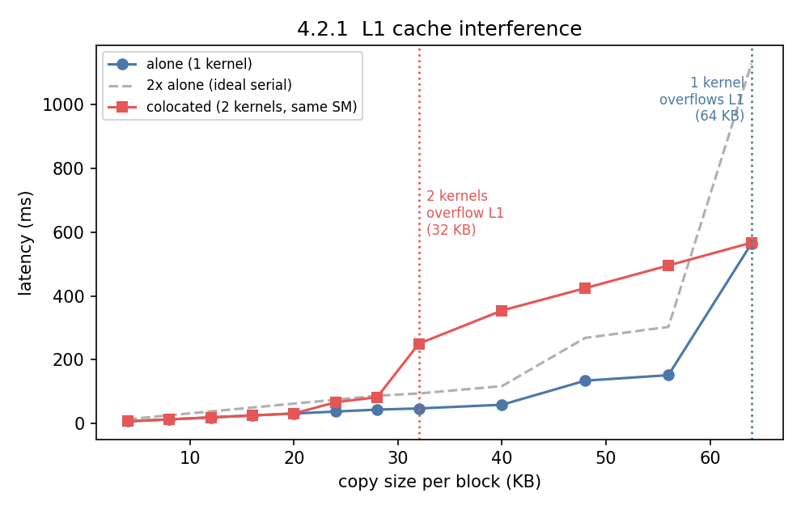
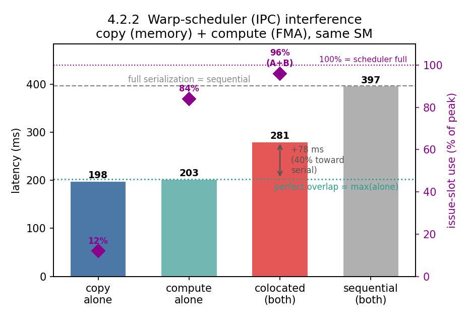
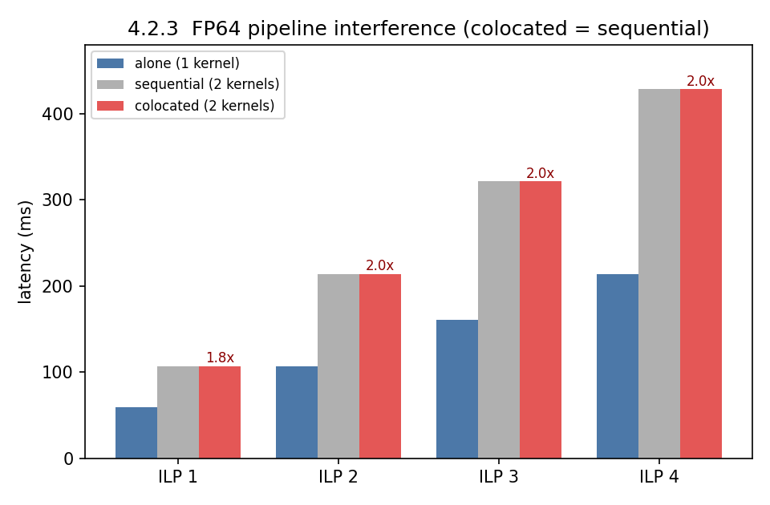

# Section 4.2 — Intra-SM Interference on the GPU

**Reproduction of "Understanding GPU Resource Interference One Level Deeper" (SoCC'25), §4.2**
Hardware: **NVIDIA GeForce RTX 5090** (Blackwell, `sm_120`, 170 SMs, 4 SMSPs/SM, 1536 threads/SM, 128 KB unified L1/SM, ~96 MB L2), CUDA 12.8, driver 580.126.09. Single GPU (`CUDA_VISIBLE_DEVICES=0`).

---

## 1. Introduction

Section 4.1 showed that two kernels interfere through resources shared *across* SMs (the block scheduler, L2, DRAM) even when they run on completely separate SMs. **Section 4.2 goes one level deeper: what happens when two kernels are forced to share the *same* SM?** Now they contend for the resources *inside* an SM:

| Experiment | Shared resource inside the SM | Paper § |
|---|---|---|
| 4.2.1 L1 cache | the per-SM L1 data cache (128 KB, shared by all 4 SMSPs) | 4.2.1 |
| 4.2.2 Warp scheduler (IPC) | the instruction-issue slots of the SM's warp schedulers | 4.2.2 |
| 4.2.3 Compute pipeline | a specific execution pipeline (here FP64) | 4.2.3 |

**Common method (same as 4.1).** Each benchmark times a workload (median of 10 runs) in three modes and compares them: **alone** (one kernel), **sequential** (two kernels back-to-back), **colocated** (two kernels concurrently, on the same SMs via CUDA streams).

> **The tell:** if *colocated ≈ alone*, the two kernels overlapped for free — **no interference**. If *colocated ≈ sequential*, the SM **serialized** them — **full interference**. In between means **partial** interference, and we quantify how far toward serialization it went.

The crucial difference from 4.1: here every experiment deliberately places **both kernels on every SM**, so they *share* the SM. The question is which *internal* resource collapses first.

### 1.1 Hardware summary and why these thread counts

The key sub-structure this section exercises is the **SMSP** (SM sub-partition). Each of the RTX 5090's 170 SMs contains **4 SMSPs**, and each SMSP has its own **warp scheduler** that can issue **one instruction per cycle** — so a single SM issues at most 4 instructions/cycle (peak "IPC" of 4). The L1 cache, by contrast, is **one structure per SM shared by all 4 SMSPs**.

| RTX 5090 spec | Value | Used to set |
|---|---|---|
| SMs | 170 | `gridDim = 170` → one block of each kernel per SM |
| SMSPs (warp schedulers) per SM | 4 | peak issue = 4 instr/cycle/SM; target of 4.2.2 |
| Max threads per SM | 1536 (48 warps) | keeps both kernels' blocks co-resident on one SM |
| **Unified L1 + shared / SM** | **128 KB** | sets the L1 sweep and the ~32 KB/block interference knee (4.2.1) |
| L2 cache | ~96 MB | used to make the 4.2.2 copy kernel *issue-bound* (its 16 MB array stays L2-resident) |
| FP64 throughput | ~1/64 of FP32 | why two FP64 kernels serialize on the tiny FP64 pipeline (4.2.3) |

Two thread counts recur, both derived from the 4-SMSP structure:

- **64 threads/block = 2 warps = half the SMSPs** (4.2.1). Each kernel's block occupies only 2 of the 4 SMSPs, so two colocated kernels can land on *different* SMSPs — sharing the L1 but **not** the warp schedulers. That isolates L1 interference.
- **128 threads/block = 4 warps = one warp per SMSP** (4.2.2, 4.2.3). Each kernel puts one warp on every SMSP, so two colocated kernels *do* share the warp schedulers / pipelines — which is exactly what those experiments test.

`gridDim` is fixed at **170** (the SM count) in all three, so each kernel places exactly one block on each SM and the two colocated kernels meet on every SM.

---

## 2. The workloads — what the kernels actually do

As in 4.1, these are deliberately one-dimensional micro-kernels, each built to stress a single internal resource.

| Kernel | Role | What it does | Stresses |
|---|---|---|---|
| `copy_kernel_per_tb` | L1 probe (4.2.1) | each block copies a private region (sized to fit L1) repeatedly | **L1 cache** |
| `copy_kernel` | memory workload (4.2.2) | grid-strided copy of an array, repeated | memory system / issues load-store instructions |
| `mul_fp32_ilp1..4` | compute workload (4.2.2) | back-to-back FP32 fused-multiplies, with 1–4 independent chains | **FP32 FMA pipeline** + warp scheduler |
| `mul_fp64_ilp1..4` | compute workload (4.2.3) | same, but **FP64** multiplies | **FP64 pipeline** |

### 2.1 The copy kernels

`copy_kernel_per_tb` gives **each thread block its own private, L1-sized region** to copy over and over — so whether it stays fast depends on whether that region fits in L1. `copy_kernel` is the same grid-strided streaming copy used in 4.1; in 4.2.2 we deliberately give it a **16 MB array that fits in L2**, so its loads return quickly and it *issues instructions continuously* (this matters — see 4.2.2).

### 2.2 The compute kernels and "ILP"

```cuda
__global__ void mul_fp32_ilp4(float *a, float *b, float *c, long long num_itr) {
    float op1=a[threadIdx.x], op2=b[threadIdx.x];
    float op3=1, op4=1, op5=1, op6=1;
    for (long long i=0; i<num_itr; i++) {   // 4 INDEPENDENT multiply chains
        op3=__fmul_rn(op1,op3); op4=__fmul_rn(op2,op4);
        op5=__fmul_rn(op1,op5); op6=__fmul_rn(op2,op6);
    }
    c[threadIdx.x]=op3+op4+op5+op6;
}
```

**ILP = instruction-level parallelism.** `mul_fp32_ilp1` keeps a *single* dependent multiply chain: each multiply must wait for the previous one, so the warp stalls between issues and IPC is low. `mul_fp32_ilp4` keeps *four independent* chains, so the scheduler always has a ready instruction to issue — **higher IPC with the same number of warps**. Raising ILP is thus a dial for "how hard this kernel leans on the warp scheduler / pipeline," *without* changing occupancy. `mul_fp64_*` are identical but use `double` — which matters enormously on a consumer GPU, where FP64 hardware is a tiny fraction of FP32.

### 2.3 How a two-kernel scenario is built

4.2.1 and 4.2.3 colocate **two identical kernels** (two copies, or two FP64 kernels). 4.2.2 colocates **two *different* kernels** — a memory copy and an FP32 compute kernel — precisely to test the paper's claim that even kernels with *complementary* resource needs still collide at the shared warp scheduler. Every kernel launches 170 blocks (one per SM); modes are the same alone / sequential / colocated as in 4.1, median of 10 runs.

---

## 3. Experiment 4.2.1 — L1 Cache

**What this shows.** Two kernels that share an SM but land on *different* SMSPs still fight over the one L1 cache that the whole SM shares. Like the L2 result in 4.1.2, the interference is a sharp cliff — invisible while both kernels' data fits in L1, then a sudden multi-× slowdown once their combined footprint overflows it.

**Setup.** Two instances of `copy_kernel_per_tb` (§2.1), each with 64-thread blocks (= 2 warps = half the SMSPs), repeated 15 000 times. We sweep the per-block copy size from 4 KB to 64 KB and compare **alone** vs **colocated**.

**Hardware placement.**

| | Kernel A | Kernel B |
|---|---|---|
| Launched from | stream 1 (same process) | stream 2 (same process) |
| Blocks per kernel | 170 (one per SM) | 170 (one per SM) |
| Threads per block | 64 (2 warps) | 64 (2 warps) |
| SMs each kernel uses | all 170 | all 170 |
| **Do the two kernels share an SM?** | **Yes** — one block from each on every SM | |
| SMSPs used per SM | 2 of 4 | the other 2 of 4 |
| **Do they share a warp scheduler?** | **No** (by design — different SMSPs) — this isolates the L1 effect | |
| Shared resource under test | the per-SM **L1 cache** (128 KB), shared by all SMSPs | |

Because each block copies an input *and* an output region, its footprint is ≈ **2× the copy size**; two colocated blocks make it ≈ **4×**, so L1 (128 KB) overflows near copy size ≈ 128 ÷ 4 ≈ **32 KB**.



**Results (selected).**

| Copy size/block | alone | colocated | colocated / alone |
|---|---|---|---|
| 16 KB |  25.0 ms |  25.0 ms | 1.00× |
| 24 KB |  37.2 ms |  66.4 ms | 1.78× |
| **32 KB** |  47.0 ms | **250.0 ms** | **5.32×** |
| 40 KB |  58.5 ms | 354.1 ms | **6.05×** |
| 48 KB | 134.1 ms | 424.2 ms | 3.16× |
| 64 KB | 564.8 ms | 566.9 ms | 1.00× |

**Reading.** The two dotted vertical lines mark the two cache cliffs (each copy kernel's footprint is 2× its copy size, so the L1 fills at copy size = 128 KB ÷ multiplier): the **red line at 32 KB** is where *two colocated* kernels' combined 4× footprint overflows L1, and the **blue line at 64 KB** is where a *single* kernel's own 2× footprint overflows it. They bracket three regimes: (1) **below the red line** both kernels' regions fit in L1 and colocated = alone; (2) **between the red and blue lines (32–56 KB)** the *colocated* pair thrashes L1 but a *single* kernel still fits — so colocated explodes to **>6× alone** and even rises **above the grey 2×-alone line** (colocation is worse than just running the two kernels one-after-another, because sharing destroys the L1 residency each kernel had to itself); (3) **at/after the blue line (≥64 KB)** a single kernel alone already overflows L1, so there is no residency left for a co-tenant to steal — colocated ≈ alone, the grey 2×-alone line shoots up past it, and concurrency pays off again. Note the two kernels never share a warp scheduler here — the entire effect comes from the shared L1.

**Takeaway.** The L1 is a shared SM resource just like the L2 is a shared GPU resource. Two kernels can sit on separate SMSPs and still cripple each other the instant their combined working set stops fitting in L1.

---

## 4. Experiment 4.2.2 — Warp Scheduler (IPC)

**What this shows.** The classic intuition is "pair a memory-bound kernel with a compute-bound kernel and they'll fill each other's idle resources for free." This experiment shows that even those *complementary* kernels interfere — because both still need the **warp scheduler** to issue their instructions, and there are only 4 issue slots per SM per cycle.

**Setup.** A memory `copy_kernel` + a compute `mul_fp32_ilp4` kernel, colocated on the same SMs. Iteration counts are tuned so each takes ~200 ms alone. **Key detail:** the copy uses a **16 MB (L2-resident) array**, so it issues load instructions continuously instead of stalling on DRAM — that is what makes it actually compete for issue slots.

**Hardware placement.**

| | Kernel A — copy (memory) | Kernel B — compute (FMA) |
|---|---|---|
| Kernel | `copy_kernel`, 16 MB array | `mul_fp32_ilp4` |
| Launched from | stream 1 | stream 2 |
| Blocks per kernel | 170 (one per SM) | 170 (one per SM) |
| Threads per block | 512 | 128 (one warp per SMSP) |
| **Do the two kernels share an SM?** | **Yes** — 512 + 128 = 640 threads ≤ 1536, both co-resident | |
| **Do they share the warp schedulers?** | **Yes** — both issue instructions on the same 4 SMSPs | |
| Execution units used | load/store units, L1/L2 | FP32 FMA pipeline |
| Shared resource under test | the **warp scheduler** (instruction-issue slots), *despite* different execution units | |



**How to read the figure.** Four latency bars plus two reference lines:
- **"copy alone" (198) and "compute alone" (203):** each kernel by itself.
- **"colocated (both)" (281):** the two run at the same time on the same SMs.
- **"sequential (both)" (397):** the two run one after the other.
- **Dotted green line at 203 = "perfect overlap":** if the two truly didn't interfere, colocating them would cost only `max(alone) = 203 ms` (the memory kernel would hide behind the compute kernel and vice-versa).
- **Dashed grey line at 397 = "full serialization":** if they couldn't overlap at all.

The colocated bar lands at **281 ms — between the two lines**, i.e. **40% of the way from perfect overlap to full serialization**. So the kernels *do* overlap substantially (281 ≪ 397), but they are **not** free (281 > 203): each steals issue slots the other needed.

**Results.**

| Case | Latency |
|---|---|
| copy alone | 198 ms |
| compute alone | 203 ms |
| **colocated** | **281 ms** |
| sequential | 397 ms |
| *perfect-overlap ideal* | *203 ms* |
| *interference* | *+78 ms = 40% toward serialization* |

**Reading.** A memory kernel and an FMA kernel use *entirely different execution units*, so a whole-GPU or even per-pipeline view predicts free overlap. Yet colocation costs 78 ms (38%) more than the ideal, because both kernels' warps queue at the same 4 issue slots per SM. Interference lives at the *scheduler*, a level above the execution units.

> **Nuance worth noting.** If the copy uses a large DRAM-resident array instead of the 16 MB L2-resident one, it stalls on memory latency, issues few instructions, and then colocation *is* almost free (we measured colocated ≈ 210 ms ≈ perfect overlap). Whether two kernels interfere at the scheduler depends on whether each is actually *issue-bound* — which no coarse "memory vs compute" label captures.

**Takeaway.** "Complementary" kernels are not automatically interference-free. Sharing an SM means sharing its warp schedulers, and two issue-bound kernels contend there no matter how different their execution-unit needs are.

---

## 5. Experiment 4.2.3 — Compute Pipeline (FP64)

**What this shows.** When two kernels both hammer the *same* execution pipeline, they cannot overlap at all — one kernel's instructions occupy the pipeline while the other's wait. We use FP64 because on a consumer GPU the FP64 pipeline is tiny, so it saturates immediately and the serialization is total.

**Setup.** Two identical `mul_fp64_ilp*` kernels, colocated, each with 128-thread blocks (one warp per SMSP), 2 000 000 iterations. We sweep the ILP degree 1→4 (more independent FP64 multiplies in flight) and compare **alone**, **sequential**, and **colocated**.

**Hardware placement.**

| | Kernel A | Kernel B |
|---|---|---|
| Kernel | `mul_fp64_ilp{1..4}` | same |
| Launched from | stream 1 | stream 2 |
| Blocks per kernel | 170 (one per SM) | 170 (one per SM) |
| Threads per block | 128 (one warp per SMSP) | 128 (one warp per SMSP) |
| **Do the two kernels share an SM?** | **Yes** — 128 + 128 = 256 threads, both co-resident | |
| **Do they share the FP64 pipeline?** | **Yes** — both feed FP64 multiplies to the same, heavily rate-limited FP64 units | |
| Shared resource under test | the **FP64 execution pipeline** | |



**Results.**

| ILP | alone | sequential | colocated | colocated / alone |
|---|---|---|---|---|
| 1 |  59 ms | 107 ms | 107 ms | 1.8× |
| 2 | 107 ms | 214 ms | 214 ms | 2.0× |
| 3 | 161 ms | 321 ms | 321 ms | 2.0× |
| 4 | 214 ms | 428 ms | 428 ms | 2.0× |

**Reading.** At **every** ILP level, **colocated = sequential** (red = grey in the figure): the two FP64 kernels get *zero* overlap and colocation is exactly as slow as running them one after the other (≈ 2× alone). On the RTX 5090 the FP64 pipeline is so rate-limited (~1/64 of FP32) that even a single kernel's one-warp-per-SMSP already saturates it, so a second FP64 kernel simply queues. (On a datacenter GPU with fast FP64, one would instead see a *transition* — overlap at low ILP, serialization only once ILP pushes the pipeline to saturation.)

**Takeaway.** Two kernels contending for the same execution pipeline are the purest form of interference: no overlap is possible, so colocation buys nothing over sequential execution.

---

## 6. Discussion

**One SM, three ways to collide.** All three experiments place both kernels on the same SMs; they differ only in which internal resource saturates first:

| Resource (inside the SM) | When it bites | colocated vs … | Worst seen |
|---|---|---|---|
| L1 cache (4.2.1) | combined footprint > 128 KB L1 | ≫ sequential | **6.0×** (mutual eviction) |
| Warp scheduler (4.2.2) | both kernels issue-bound | between overlap & serial | +40% toward serial |
| FP64 pipeline (4.2.3) | both use the same pipeline | = sequential | 2.0× (total serialization) |

**The recurring "one level deeper" lesson.** In each case a coarse view mispredicts:
- 4.2.1 — the two kernels are on different SMSPs, so an SMSP-level view says "independent." The shared L1 says otherwise.
- 4.2.2 — a "memory vs compute" view says "complementary, free to overlap." The shared warp scheduler says otherwise (when both are issue-bound).
- 4.2.3 — occupancy is modest (one warp per SMSP), so an occupancy view says "room to spare." The saturated FP64 pipeline says otherwise.

**L1 mirrors L2.** 4.2.1 reproduces 4.1.2's cache-cliff exactly, one level down (128 KB L1 vs 96 MB L2). Both show colocation can be *worse than serial* when it destroys cache locality that each kernel enjoyed alone — the strongest argument against blindly colocating cache-sensitive kernels.

**RTX 5090 vs H100 (paper).** Mechanisms reproduce; thresholds and shapes shift with the hardware. The clearest difference is 4.2.3: the paper's H100 has strong FP64 and shows a *gradual* onset of pipeline interference with ILP, whereas the RTX 5090's crippled FP64 serializes fully even at ILP 1. The L1 cliff sits at a different byte size (128 KB L1), and the 4.2.2 effect size depends on making the copy issue-bound. State the GPU on any figure.

**Limitations.** Medians of 10 runs on an idle GPU. The L1 knee depends on the copy touching two regions (footprint = 2× size/block) and on the 128 KB carveout. The 4.2.2 result is configuration-sensitive (issue-bound vs latency-bound copy, ILP degree, thread counts) — the point is that interference *can* occur at the scheduler, not that it always does. NCU counters (`l1tex__t_sector_hit_rate.pct`, `sm__inst_issued.avg.per_cycle_active`, `sm__inst_executed_pipe_fma...`) would corroborate the latency story but need performance-counter permissions.

---

## 7. How to reproduce

```bash
cd section_4.2
cmake -S code -B build && cmake --build build -j     # build 3 benchmarks (sm_120)
bash scripts/run_421_l1.sh                           # 4.2.1  L1 cache      (~1 min)
bash scripts/run_422_ipc.sh                          # 4.2.2  warp scheduler (~30 s)
bash scripts/run_423_pipelines.sh                    # 4.2.3  FP64 pipeline  (~1 min)
python3 scripts/parse_and_plot.py                    # -> results/*.csv, figures/*.png
```

**Artifacts.** Raw logs and parsed CSVs in [`results/`](results/); figures in [`figures/`](figures/).
