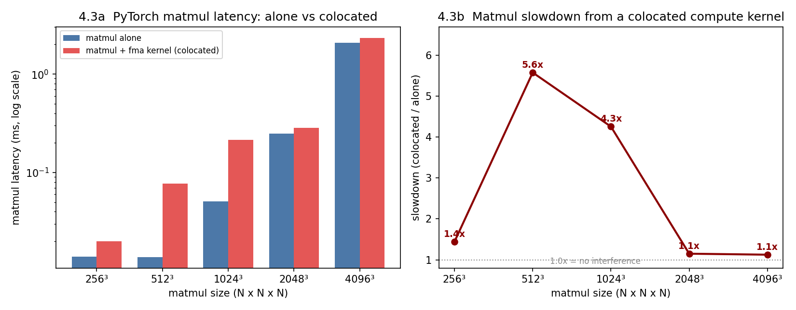

# Section 4.3 — Interference on a Real ML Kernel

**Reproduction of "Understanding GPU Resource Interference One Level Deeper" (SoCC'25), §4.3**
Hardware: **NVIDIA GeForce RTX 5090** (Blackwell, `sm_120`, 170 SMs, 4 SMSPs/SM), CUDA 12.8, driver 580, PyTorch 2.8 (cu128). Single GPU (`CUDA_VISIBLE_DEVICES=0`).

---

## 1. Introduction

Sections 4.1 and 4.2 used synthetic micro-kernels to isolate *individual* shared resources. **Section 4.3 asks the practical question: does any of this actually happen to a real, production ML kernel?** The answer is yes — and this experiment shows it on PyTorch's matrix-multiply (`torch.mm`), the single most important operation in deep-learning workloads.

The setup is a concrete instance of GPU sharing that happens all the time in practice: two jobs are packed onto one GPU to raise utilization. Here one "job" is a PyTorch matmul running in a loop (standing in for an inference or training kernel); the other is a compute-heavy CUDA kernel (standing in for a co-tenant). They run **concurrently on the same GPU** via separate CUDA streams, launched from separate Python threads.

**What this shows.** The matmul and the competitor both lean on the **FP32 fused-multiply-add (FMA) pipeline** and the **warp schedulers** inside each SM (§4.2's resources). So when they are colocated, the matmul slows down — and, crucially, *how much* depends on the matmul's **size**: an operation that already saturates the GPU barely notices, while a smaller one that leaves the FMA pipeline partly idle gets badly hurt. A single "GPU is busy" number cannot predict this.

**Method.** For each square matrix size we measure the matmul's latency (median over 101 runs) **alone**, then **colocated** with the competitor kernel, and report the slowdown. The competitor is sized to run continuously for the whole matmul loop, so the matmul is genuinely under contention the entire time it is measured.

### 1.1 The two "jobs"

| | Job A — the ML kernel | Job B — the competitor |
|---|---|---|
| What it is | `torch.mm(A, B)`, FP32, square `N×N` matrices | custom `fma_fp32_ilp4` CUDA kernel |
| Stands in for | a real inference/training matmul | a co-located compute-bound tenant |
| Launched from | a PyTorch CUDA stream (Python thread 1) | its own non-blocking CUDA stream via CTypes (Python thread 2) |
| Grid / block | chosen by cuBLAS for the size | 170 blocks × 128 threads (1 warp per SMSP, all SMs) |
| Primary hardware use | FP32 FMA pipeline (+ memory, for large `N`) | FP32 FMA pipeline, high IPC |

Both jobs run on **all 170 SMs**, so they **share every SM** and contend for its FMA pipelines and warp schedulers — this is the intra-SM interference of §4.2, now hitting a real kernel.

### 1.2 The competitor kernel

```cuda
__global__ void fma_fp32_ilp4(float *a, float *b, float *c, long long num_itrs) {
    float op1=a[threadIdx.x], op2=b[threadIdx.x], op3=0,op4=0,op5=0,op6=0;
    for (long long i=0;i<num_itrs;i++){          // 4 independent FMA chains -> high IPC
        op3=__fmaf_rn(op1,op2,op3); op4=__fmaf_rn(op1,op2,op4);
        op5=__fmaf_rn(op1,op2,op5); op6=__fmaf_rn(op1,op2,op6);
    }
    c[threadIdx.x]=op3+op4+op5+op6;
}
```

It does nothing but stream fused-multiply-adds through the FP32 pipeline at high instruction-level parallelism (the ILP-4 idea from §2 of the 4.2 report) — a pure, sustained load on exactly the resource `torch.mm` also needs.

---

## 2. Results

We swept square matmuls from 256³ to 4096³.



| Matrix size | matmul alone | matmul colocated | **slowdown** |
|---|---|---|---|
| 256³  | 0.0140 ms | 0.0201 ms | 1.4× |
| **512³**  | 0.0139 ms | 0.0772 ms | **5.6×** |
| 1024³ | 0.0507 ms | 0.2157 ms | **4.3×** |
| 2048³ | 0.2474 ms | 0.2843 ms | 1.1× |
| 4096³ | 2.0732 ms | 2.3319 ms | 1.1× |

**How to read the figure.**
- **Left (4.3a):** the matmul's latency alone (blue) vs colocated (red), on a **log scale** because latencies span 0.014 ms to 2.3 ms. The red/blue gap is the interference; it is widest at 512³–1024³.
- **Right (4.3b):** the same data as a **slowdown ratio** (colocated ÷ alone) vs matrix size. 1.0 (dotted) would mean no interference. The curve peaks sharply at **512³ (5.6×)** and falls to ~1.1× at both ends.

---

## 3. Discussion

**The interference is real, and it is large.** A common-case FP32 matmul (512³) runs **5.6× slower** simply because a compute kernel is sharing the GPU — even though both would report "100% utilization" on their own. This is the paper's headline applied to a production kernel: colocation that looks safe by coarse metrics can be very unsafe.

**Why the slowdown is non-monotonic in size — the key insight.** The curve is not "bigger = worse"; it peaks in the middle:

- **Small (256³):** the matmul is so tiny (a handful of thread blocks, microseconds long) that it barely occupies the GPU and finishes almost instantly; there is little time to overlap and the launch/queue overhead dominates, so the *relative* slowdown is modest (1.4×).
- **Medium (512³–1024³):** the matmul is **compute/FMA-bound but does not fill the machine** — it leaves FMA-pipeline and issue-slot capacity idle on many SMs. The competitor pours FP32 FMAs into exactly that idle capacity, so the two collide hard on the shared pipeline → **4–6× slowdown**. These are precisely the small-to-medium matmuls ubiquitous in real models (attention projections, per-head GEMMs, small MLPs).
- **Large (2048³, 4096³):** the matmul **already saturates the GPU** and, as the matrices grow, becomes increasingly **memory-bound** rather than FMA-bound. There is no idle FMA capacity for the competitor to exploit, and the matmul is no longer bottlenecked on the contended resource — so the slowdown collapses to ~1.1×.

**This is the "one level deeper" thesis, end to end.** Whether a real ML kernel suffers interference is not predictable from "is the GPU busy?" — it depends on *which* internal resource the kernel bottlenecks on (§4.2's FMA pipeline / warp scheduler) and how much of that resource it leaves on the table. The synthetic experiments in 4.1–4.2 explained the mechanism; here it plays out on `torch.mm` with a 5.6× worst case.

**Practical takeaway for colocation / scheduling.** Packing a compute-bound tenant next to an ML serving kernel is safe *only* when the ML kernel already saturates the shared pipeline (large, memory-bound GEMMs). For the small-to-medium, compute-bound matmuls that dominate latency-sensitive inference, the same packing can inflate latency several-fold. A scheduler that reasons only about occupancy or `nvidia-smi` utilization cannot tell these cases apart.

**RTX 5090 vs H100 (paper).** The mechanism reproduces; the exact peak location and magnitude depend on the GPU's FMA throughput, cuBLAS kernel selection per size, and when the matmul crosses from compute- to memory-bound. Absolute numbers here are RTX 5090 / cuBLAS-for-`sm_120`; the *shape* — worst interference for mid-size, compute-bound matmuls — is the transferable result.

**Limitations.** Latencies are medians of 101 runs on an otherwise-idle GPU; `torch.mm` dispatches size-dependent cuBLAS kernels, so the curve partly reflects kernel-selection boundaries as well as interference. FP32 (not TF32/FP16 tensor-core) matmul is used, to keep the shared resource the same FP32 FMA pipeline the competitor stresses; a tensor-core matmul would contend on the tensor pipeline instead. The competitor is fixed at 170×128; a stronger or weaker competitor shifts the magnitudes but not the shape. Nsight Systems (`nsys`) traces would visually confirm the two kernels overlap on the timeline.

---

## 4. How to reproduce

Requires a Python environment with CUDA-enabled PyTorch (validated: torch 2.8, cu128).

```bash
cd section_4.3
cmake -S code -B build && cmake --build build -j   # build libpython_interface.so (sm_120)
bash scripts/run_431_mm.sh                          # sweep 256..4096, ~1-2 min
python3 scripts/parse_and_plot.py                   # -> results/mm_pytorch.csv, figures/*.png
```

**Artifacts.** Raw log + parsed CSV in [`results/`](results/); figure in [`figures/`](figures/).
